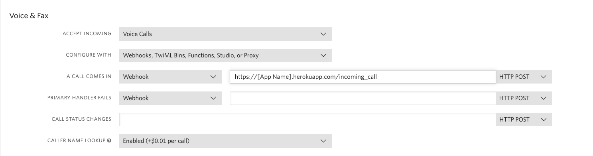

# VoiceIt API 2.0 IVR Demo
IVR demo showing an integration between VoiceIt's API 2.0 and Twilio's API

## Pre-Requisites

- Twilio Account -- [Twilio Developer Registration](https://www.twilio.com/try-twilio)
- VoiceIt Account -- [VoiceIt Developer Registration](https://voiceit.io/signup)
- Heroku Account for hosting app -- [Heroku Developer Registration](https://signup.heroku.com)

After installation you will also need to log in to your Twilio account and point a purchased phone number to this new application like shown below. Make sure to set the webhook for when call comes in to the right URL and set the HTTP request to POST.

1. Get the App URL from your Heroku app console.

2. Add the App URL to the Twilio Phone Number POST Webhook (Twilio Console > Phone Number > Phone Number Settings > "A Call Comes In...")

You can call the Twilio number you have pointed to the application and try out the demo, and modify it as desired for your own use case. You can also check out our demo by calling <a href="tel:1-612-400-7423">(612) 400-7423</a>.

## Install/Configure

1. Clone this repository via the command `git clone https://github.com/voiceittech/VoiceIt2-Twilio-Demo.git`
2. `cd  VoiceIt2-Twilio-Demo`
3. `npm i` to install NPM package dependencies
4. To run locally, create a .env file and set the environment variables `API_KEY` and `API_TOKEN` to your VoiceIt API key and token, `VOICEPRINT_PHRASE` to a phrase that you have pre - approved in the VoiceIt console, `CONTENT_LANGUAGE` to associated contentLanguage, and `DATABASE_URL` from the DB added below.
5. `npm start`

We are using Postgres for our example, so you may need to install Postgres locally: https://devcenter.heroku.com/articles/heroku-postgresql#local-setup

    $ heroku addons:create heroku-postgresql:hobby-dev
    $ heroku pg:psql
    => create table users (phone text, userId text);

## Deploy to Heroku

    $ heroku create
    $ git push heroku master
    $ heroku config:set API_KEY=123456abcdef123456 API_TOKEN=123456abcdef123456 VOICEPRINT_PHRASE='Never forget tomorrow is a new day' CONTENT_LANGUAGE=en-US DATABASE_URL=postgres://
